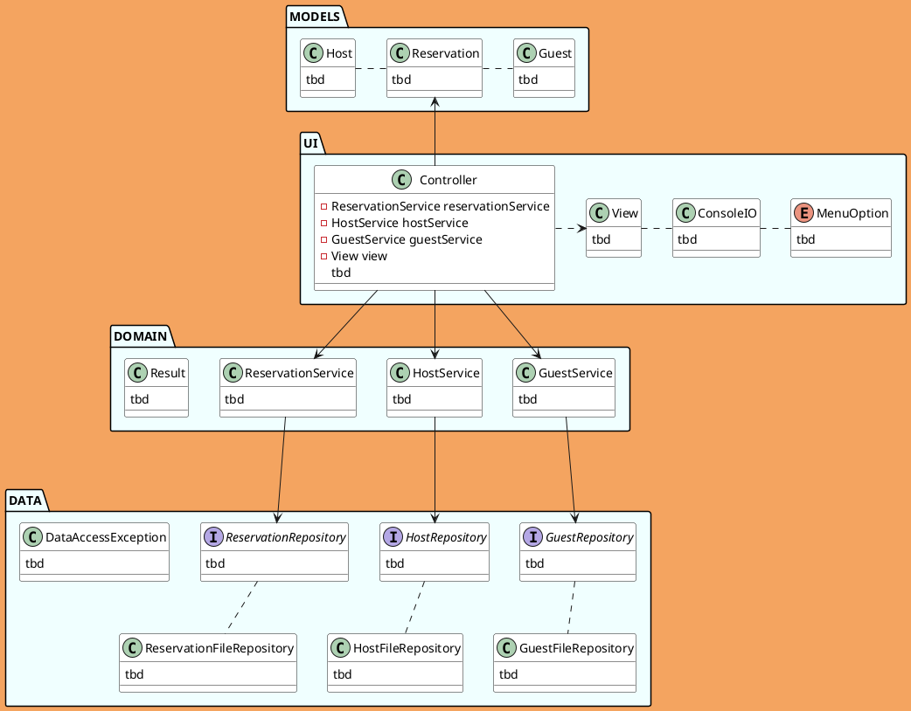
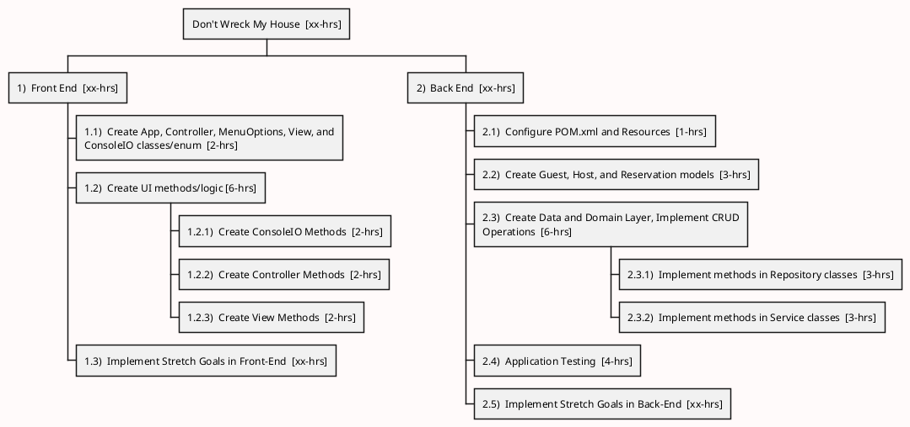
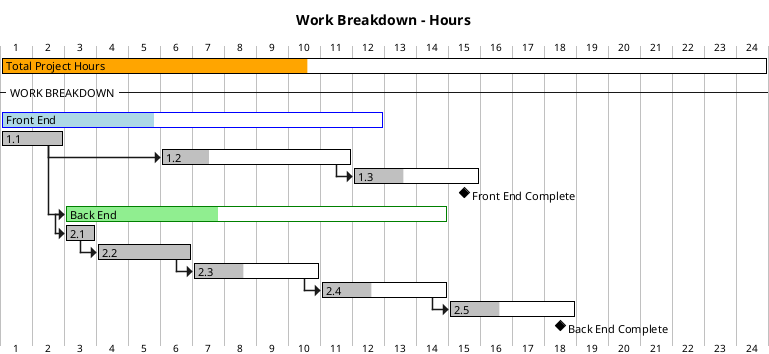

# Don't Wreck My House
A **Multi-Layer Application** that allows a user to reserve rooms for guests with a specified host. 
- Created by *Miro Stojanovic*, with specifications and assistance from Dev-10 Instructors.

## Application Specifications:
### General Requirements:
- Application user is an accommodation admin, pairing guests to host's to make reservations
- Admin may _**view existing reservations**_ for a host
- Admin _**create a reservation for a guest**_ w a host
- Admin may _**edit existing reservations**_
- Admin may _**cancel future reservations**_
- Must be Maven project
- Spring Dependency Injection 
- BigDecimal for financial math
- LocalDate for Dates
- All file data must be represented in models 
- Combo of reservation ID + host ID is req'd to uniquely ID a reservation

### Required Features:
 - **View Reservations for Host -**
   - User uniquely identifies host (some way, can be by search, by email, etc.) then show all reservations
   - One idea: Search by state -> drop list of hosts?
   - Have validation for nonexistent hosts, or hosts with no reservations
   - Show useful info for reservation (guest, dates, total$, etc.)
   - Sort reservations in a meaningful way (date? prompt user for choice?)
 - **Make a Reservation for a Guest (as Admin) -**
   - Admin enters value that uniquely ID's guest, and then host
   - Should show hosts future reservations so the right dates can be selected
   - Should enter a start and end date, calculate the total, display a summary, and confirm/save
   - Make sure to calculate given weekday rates and weekend rates
   - Do proper validation for guest, host, dates
 - **Edit a Reservation -**
   - Be able to find a reservation, and edit the dates only
   - Recalculate and display the total, summary, and ask user to confirm
   - Do proper validation for guest, host, dates
 - **Cancel a Reservation -**
   - Cancel a future reservation by finding it then deleting it
   - No canceling reservations that are in the past, only show future ones

### Glossary:
- _**Guest**_: Customer that wants to book a stay (Guest data is provided)
- **_Host_**: Accommodation provider (Host data is provided)
- _**Location:**_ A rental property (one location per 1 host)
- _**Reservation:**_ Day(s) where a Guest has exclusive rights to the Location / Host. 
- _**Admin:**_ The app user. Guests and Hosts don't book their own reservations, the admin does.

### User Story:
- As the administrator and user of the app -
  - I want to be able to easily view reservations and sufficient relevant details associated with them
  - I want to be able to seamlessly make and edit reservations, as well as delete them
  - I want to be able to enter information without fear of minor errors breaking the application

### Stretch Goals:
- Make reservation ID's unique across the entire application
- Allow user to create, edit, and delete guests
- Allow user to create, edit, and delete hosts
- Display reservations for guest
- Display all reservations for a state, city, or zip code
- Implement another set of repo's that store data in JSON format

## Application Planning:
Convert these eventually to the gantt chart below
- Configure POM.xml --> 0.5-hrs 
- Create packages and initial classes/enums/interfaces
  - App, UI and Models --> 1-hrs
  - Data and domain layer --> 1-hr
- Fully create models --> 3hrs

<!-- Class Diagram / Charting of the Application Development Project-->
### *Class Diagram*

<!-- Work Breakdown Structure of the Application Development Project-->
### *Work Breakdown*

<!-- Gantt Charting the Application Development Project -->
### *Gantt Chart*
