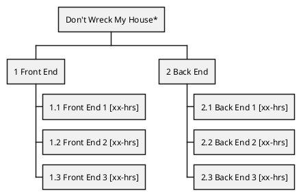

```plantuml
@startgantt
title Work Breakdown - Hours

/' Days in Gantt format below = Hours in project IRL '/

[Total Project Hours] lasts 24 days
[Total Project Hours] is colored in orange/black
[Total Project Hours] is 40% complete
--WORK BREAKDOWN --
[Front End] lasts 12 days
[Front End] is colored in lightblue/blue
[Front End] is 40% complete
    [1.1] lasts 4 days
        [1.1] is colored in silver/black
        [1.1] is 40% completed
    [1.2] starts at [1.1]'s end and lasts 4 days
        [1.2] is colored in silver/black
        [1.2] is 40% completed
    [1.3] starts at [1.2]'s end and lasts 4 days
        [1.3] is colored in silver/black
        [1.3] is 40% completed
    
[Back End] starts at [1.3]'s end and lasts 12 days
[Back End] is colored in lightgreen/green
[Back End] is 40% completed
    [2.1] starts at [Back End]'s start and lasts 4 days
        [2.1] is colored in silver/black
        [2.1] is 40% complete
    [2.2] starts at [2.1]'s end and lasts 4 days
        [2.2] is colored in silver/black
        [2.2] is 40% complete
    [2.3] starts at [2.2]'s end and lasts 4 days
        [2.3] is colored in silver/black
        [2.3] is 40% complete

@endgantt
```

# Don't Wreck My House
A **Multi-Layer Application** that allows a user to reserve rooms for guests with a specified host. 

## Technical Requirements:
- a
- b
- c
- d
- e

## "User Stories":
- a
- b
- c

## Application Planning:

- Configure POM.xml --> 0.2-hrs 

<!-- Work Breakdown Structure of the Application Development Project-->
### Work Breakdown

<!-- Gantt Charting the Application Development Project -->
