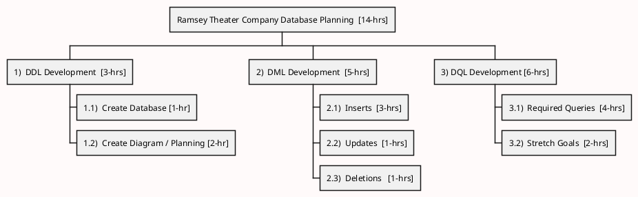
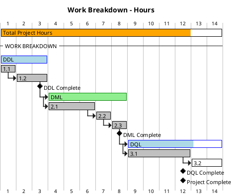

## Database Planning:

<!-- Work Breakdown Structure of the Application Development Project-->
### *Work Breakdown*

```plantuml
@startwbs
skinparam linetype poly
skinparam backgroundColor snow

<style>
node {
MaximumWidth 350
}
</style>
* Ramsey Theater Company Database Planning  [14-hrs]
** 1)  DDL Development  [3-hrs]
*** 1.1)  Create Database [1-hr]
*** 1.2)  Create Diagram / Planning [2-hr]
** 2)  DML Development  [5-hrs]
*** 2.1)  Inserts  [3-hrs]
*** 2.2)  Updates  [1-hrs]
*** 2.3)  Deletions   [1-hrs]
** 3) DQL Development [6-hrs]
*** 3.1)  Required Queries  [4-hrs]
*** 3.2)  Stretch Goals  [2-hrs]
@endwbs
```

<!-- Gantt Charting the Application Development Project -->
### *Gantt Chart*

```plantuml
@startgantt
printscale daily zoom 2
title Work Breakdown - Hours

/' Days in Gantt format below = Hours in project IRL '/

[Total Project Hours] lasts 14 days
[Total Project Hours] is colored in orange/black
[Total Project Hours] is 86% complete
--WORK BREAKDOWN --
[DDL] lasts 3 days
[DDL] is colored in lightblue/blue
[DDL] is 100% complete
    [1.1] lasts 1 days
        [1.1] is colored in silver/black
        [1.1] is 100% completed
    [1.2] starts after [1.1]'s end and lasts 2 days
        [1.2] is colored in silver/black
        [1.2] is 100% completed
[DDL Complete] happens at [1.2]'s end

[DML] starts at [1.2]'s end and lasts 5 days
[DML] is colored in lightgreen/green
[DML] is 100% complete
    [2.1] starts at [DML]'s start and lasts 3 days
        [2.1] is colored in silver/black
        [2.1] is 100% complete
    [2.2] starts at [2.1]'s end and lasts 1 days
        [2.2] is colored in silver/black
        [2.2] is 100% complete
    [2.3] starts at [2.2]'s end and lasts 1 days
        [2.3] is colored in silver/black
        [2.3] is 100% complete
[DML Complete] happens at [2.3]'s end

[DQL] starts at [2.3]'s end and lasts 6 days
[DQL] is colored in lightblue/blue
[DQL] is 70% complete
    [3.1] starts at [DQL]'s start and lasts 4 days
        [3.1] is colored in silver/black
        [3.1] is 100% completed
    [3.2] starts after [3.1]'s end and lasts 2 days
        [3.2] is colored in silver/black
        [3.2] is 0% completed
[DQL Complete] happens at [3.1]'s end
[Project Complete] happens at [3.1]'s end

@endgantt
```