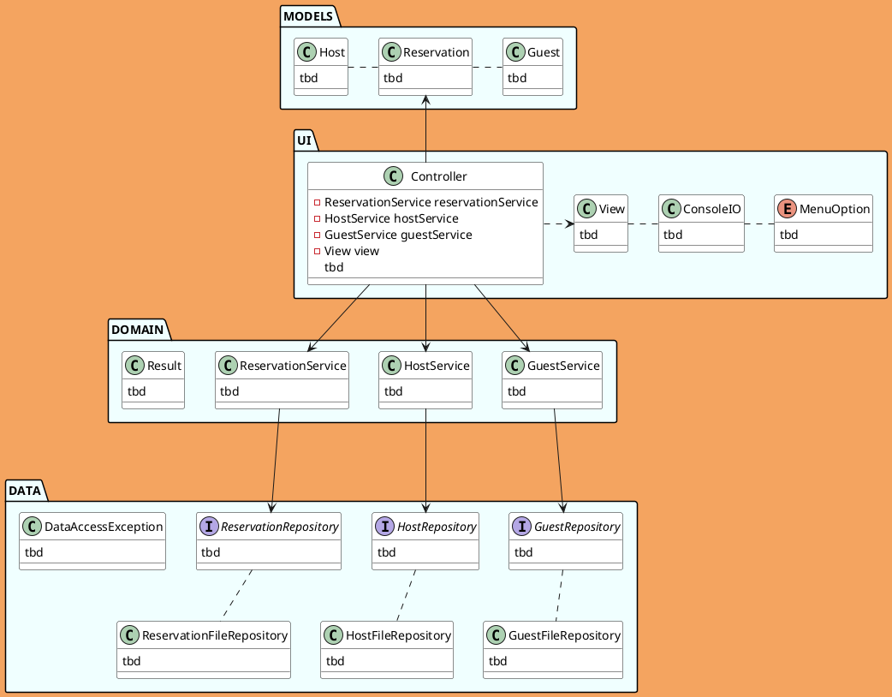
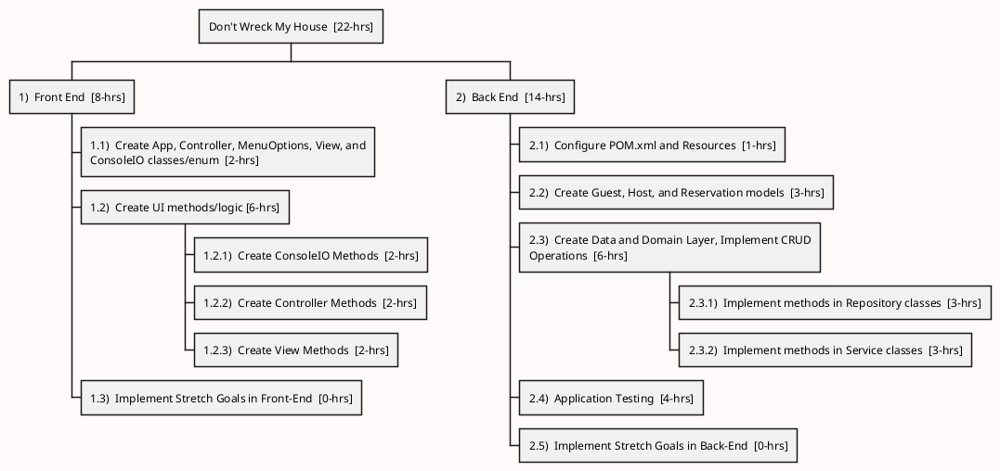
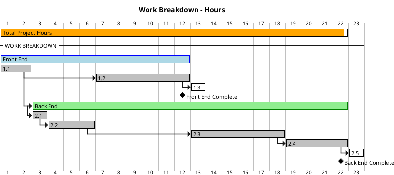

copy and pasted from last project

## Application Planning:

<!-- Class Diagram / Charting of the Application Development Project-->
### *Class Diagram*

<!-- Work Breakdown Structure of the Application Development Project-->
### *Work Breakdown*

<!-- Gantt Charting the Application Development Project -->
### *Gantt Chart*
